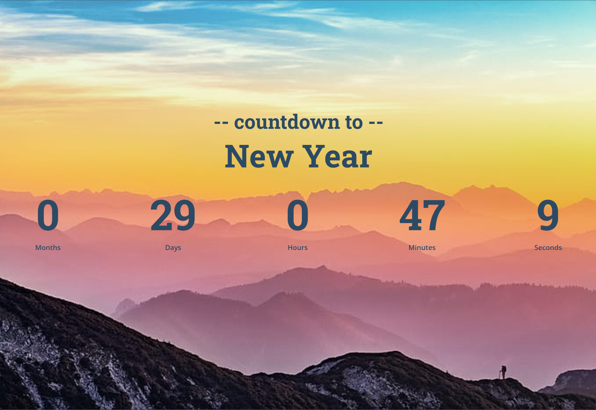

# Countdown Timer Challenge

This project is a simple and visually appealing countdown timer built as part of the [FrontendPro Countdown Timer Challenge](https://www.frontendpro.dev/frontend-coding-challenges/countdown-timer-B7Jt5LYOpcWMkYU0fvAL). The timer dynamically calculates and displays the remaining time to the upcoming New Year, updating every second. Once the countdown reaches zero, it displays a festive "Happy New Year!" message.

## Table of Contents

- [Overview](#overview)
- [Features](#features)
- [Technologies Used](#technologies-used)
- [Setup Instructions](#setup-instructions)
- [Code Explanation](#code-explanation)
- [Responsive Design](#responsive-design)
- [Future Improvements](#future-improvements)

---

## Overview

The Countdown Timer project calculates and displays the time remaining until the next New Year in months, days, hours, minutes, and seconds. It features an interactive and user-friendly design with hover animations. The countdown runs in real time using JavaScript, providing an engaging way to visualize the passage of time.

### Screenshot



---

## Features

- **Dynamic Countdown:** The timer calculates and updates the remaining time to the New Year every second.
- **Responsive Design:** The layout adapts to different screen sizes, ensuring usability on desktops, tablets, and mobile devices.
- **Interactive Animations:** Hover effects on the time segments add a touch of interactivity.
- **Stylish UI:** A visually appealing design with a serene background image of mountains and fog.

---

## Technologies Used

- **HTML5:** For structuring the web page.
- **CSS3:** For styling and animations.
- **JavaScript:** For the dynamic countdown logic.
- **Google Fonts:** For custom typography.

---

## Setup Instructions

Follow these steps to set up and run the project locally:

1. **Clone the Repository:**
   ```bash
   git clone https://github.com/Yashi-Singh-9/Countdown-Timer
   cd Countdown-Timer
   ```

2. **Open the Project:**
   - Open `index.html` in your favorite browser to view the timer.

3. **Customizing the Target Date (Optional):**
   - To change the countdown's target date, update the `targetDate` in `script.js`:
     ```javascript
     const targetDate = new Date('YYYY-MM-DDTHH:mm:ss');
     ```

---

## Code Explanation

### HTML Structure

The HTML defines a simple and semantic structure:
- A container with headings for context.
- A timer section divided into individual time segments (`months`, `days`, etc.), each dynamically updated.

### CSS Styling

The CSS creates a polished UI:
- A **mountain background** for a calming aesthetic.
- **Flexbox layout** for centering content and aligning timer segments.
- **Media queries** for responsive adjustments.

### JavaScript Logic

The JavaScript calculates and displays the remaining time:
1. **Calculate Time Difference:** Subtract the current date from the target date.
2. **Convert Milliseconds:** Convert the difference into months, days, hours, minutes, and seconds.
3. **Update UI:** Update the corresponding HTML elements every second.
4. **Final State:** Replace the timer with "Happy New Year!" when the countdown ends.

---

## Responsive Design

- **Desktop View:** Displays evenly spaced time segments with large, bold numbers.
- **Tablet and Mobile View:** Reduces spacing and font sizes for compact presentation.

---

## Future Improvements

Here are some ideas to enhance the project further:
1. **Customizable Date Picker:** Allow users to set their own countdown target date.
2. **Themes:** Add multiple background and color themes for user personalization.
3. **Sound Effect:** Play a celebratory sound when the timer reaches zero.
4. **PWA Support:** Turn this project into a Progressive Web App (PWA) for offline use.

---

## Acknowledgments

This project was completed as part of a challenge from [FrontendPro](https://www.frontendpro.dev/). Special thanks to the platform for providing the inspiration and resources for this project.

---

## License

This project is open-source and available under the MIT License.
